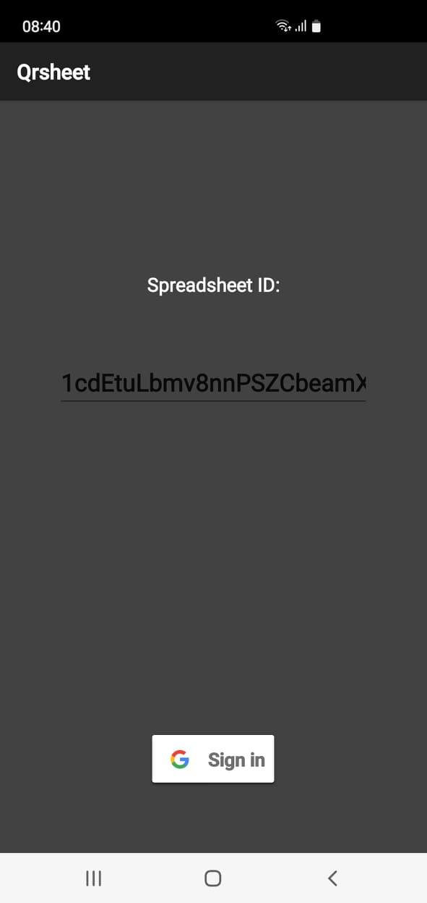
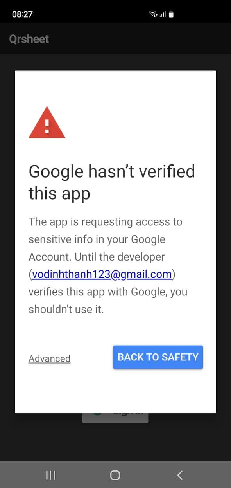
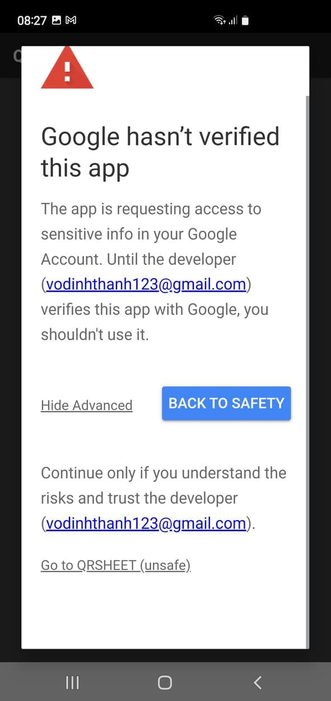
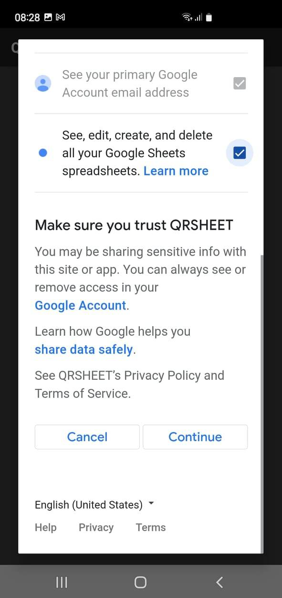
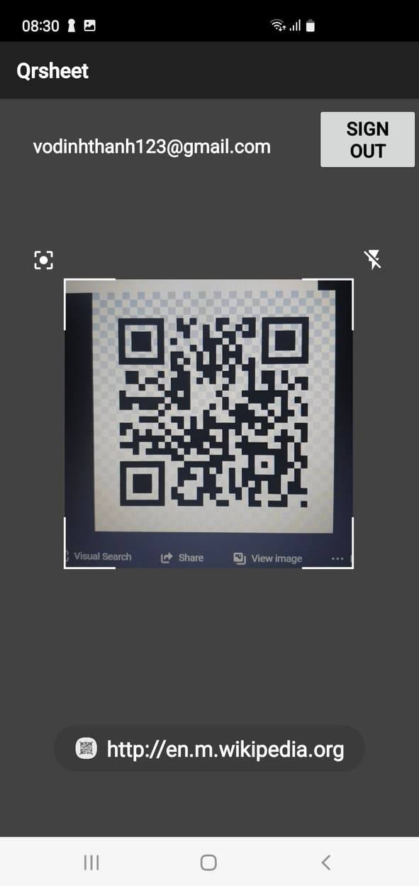
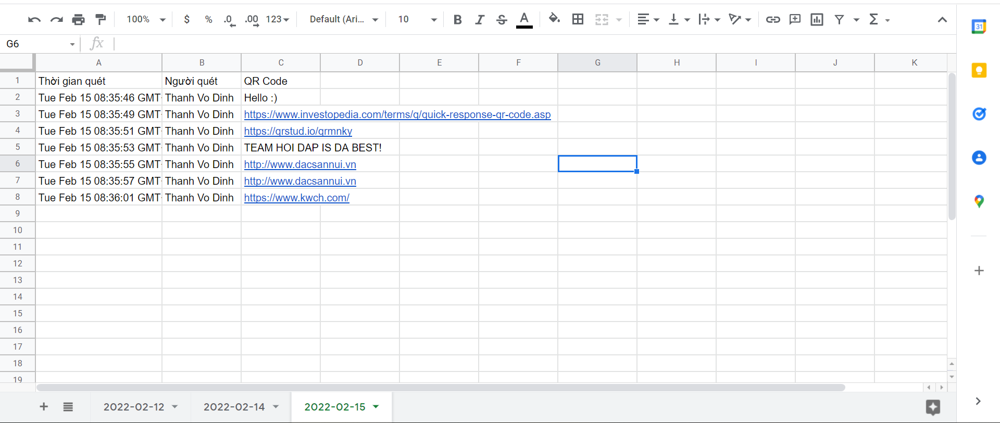

Qrtosheet
=========================

- An app that allows you to write to sheet by calling Sheets API.

Link APK
------------

- https://drive.google.com/file/d/1mi97gfy4TEKX8orFOKdOuq9HaehQghb7/view?usp=sharing

How to use
---------------

- Open the App.
- Provide it Camera permission.
- Input Spreadsheet ID( The ID is the value between '/d/' and '/edit' in the URL of the Google Sheet). 
- Sign in with google and check the provide Editing Sheet permission box( You may need to press 'Advanced option' because this App isn't endorsed by Google).
- Make sure your accounts have pemissions to write to Spreadsheet.
- Scan to write.
- It separates results by days. If this is the first you use this App in that day, it automatically create a page with name is that day.

Screenshots
-----------

Support
-------

If you have any ideas or suggestions please let me know through thanhvo.dev@gmail.com
